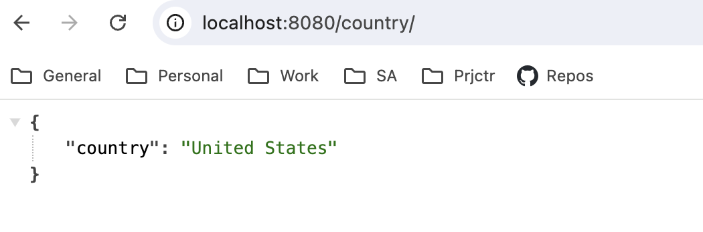
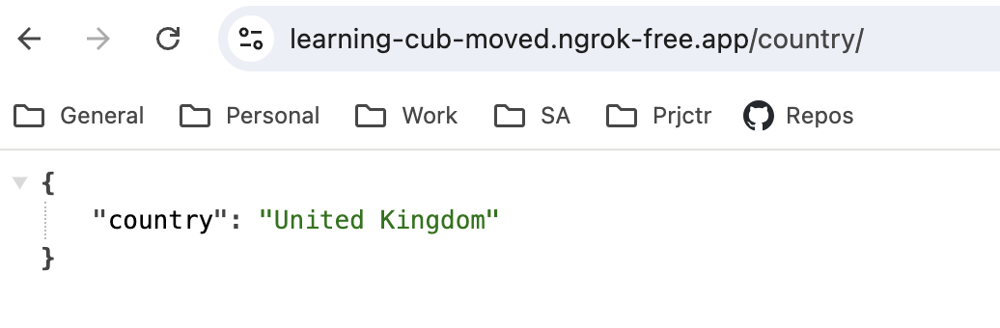

# HSA load balancing
Load balancing technics

<h4>Ngrok</h4>

[Ngrok quick start](https://ngrok.com/docs/getting-started/)

Put your app online:
```
ngrok http http://localhost:8080
```

Create own domain via ngrok: ``domain=learning-cub-moved.ngrok-free.app``
```
ngrok http --domain=learning-cub-moved.ngrok-free.app http://localhost:8080
```

<h4>GeoIP support</h4>

* [Nginx GeoIP2 module](https://github.com/nginx-modules/ngx_http_geoip2_module)
* [Nginx docker image with GeoIP support](https://hub.docker.com/r/anroe/nginx-geoip2)

<h3>Task</h3>

1. Set up load balancer on nginx that will have 1 server for UK, 2 servers for US, and 1 server for the rest. 
2. In case of failure, it should send all traffic to backup server. 
3. Health check should happen every 5 seconds.

<h3>Description</h3>

Configured necessary setup. Setup is tested with TouchVPN. 

To test backup and health checks please stop ``others-server`` container. 

Only passive health checks are configured.

Geo-balancer logs
```
2024-09-12 12:26:41 192.168.65.1 - [12/Sep/2024:09:26:41 +0000] "GET /country/ HTTP/1.1" 200 33 "-" "Mozilla/5.0 (Macintosh; Intel Mac OS X 10_15_7) AppleWebKit/537.36 (KHTML, like Gecko) Chrome/127.0.0.0 Safari/537.36" "92.253.236.163" country_code=UA
2024-09-12 12:27:00 192.168.65.1 - [12/Sep/2024:09:27:00 +0000] "GET /country/ HTTP/1.1" 304 0 "-" "Mozilla/5.0 (Macintosh; Intel Mac OS X 10_15_7) AppleWebKit/537.36 (KHTML, like Gecko) Chrome/127.0.0.0 Safari/537.36" "2.58.44.54" country_code=NL
2024-09-12 12:27:01 192.168.65.1 - [12/Sep/2024:09:27:01 +0000] "GET /country/ HTTP/1.1" 304 0 "-" "Mozilla/5.0 (Macintosh; Intel Mac OS X 10_15_7) AppleWebKit/537.36 (KHTML, like Gecko) Chrome/127.0.0.0 Safari/537.36" "2.58.44.54" country_code=NL
2024-09-12 12:27:22 192.168.65.1 - [12/Sep/2024:09:27:22 +0000] "GET /country/ HTTP/1.1" 200 32 "-" "Mozilla/5.0 (Macintosh; Intel Mac OS X 10_15_7) AppleWebKit/537.36 (KHTML, like Gecko) Chrome/127.0.0.0 Safari/537.36" "185.239.174.66" country_code=GB
2024-09-12 12:27:33 192.168.65.1 - [12/Sep/2024:09:27:33 +0000] "GET /country/ HTTP/1.1" 304 0 "-" "Mozilla/5.0 (Macintosh; Intel Mac OS X 10_15_7) AppleWebKit/537.36 (KHTML, like Gecko) Chrome/127.0.0.0 Safari/537.36" "185.239.174.66" country_code=GB
2024-09-12 12:28:05 192.168.65.1 - [12/Sep/2024:09:28:05 +0000] "GET /country/ HTTP/1.1" 304 0 "-" "Mozilla/5.0 (Macintosh; Intel Mac OS X 10_15_7) AppleWebKit/537.36 (KHTML, like Gecko) Chrome/127.0.0.0 Safari/537.36" "-" country_code=US
2024-09-12 12:28:06 192.168.65.1 - [12/Sep/2024:09:28:06 +0000] "GET /country/ HTTP/1.1" 304 0 "-" "Mozilla/5.0 (Macintosh; Intel Mac OS X 10_15_7) AppleWebKit/537.36 (KHTML, like Gecko) Chrome/127.0.0.0 Safari/537.36" "-" country_code=US
```


